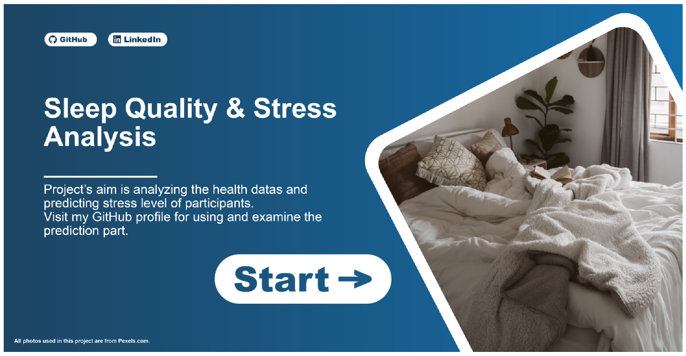
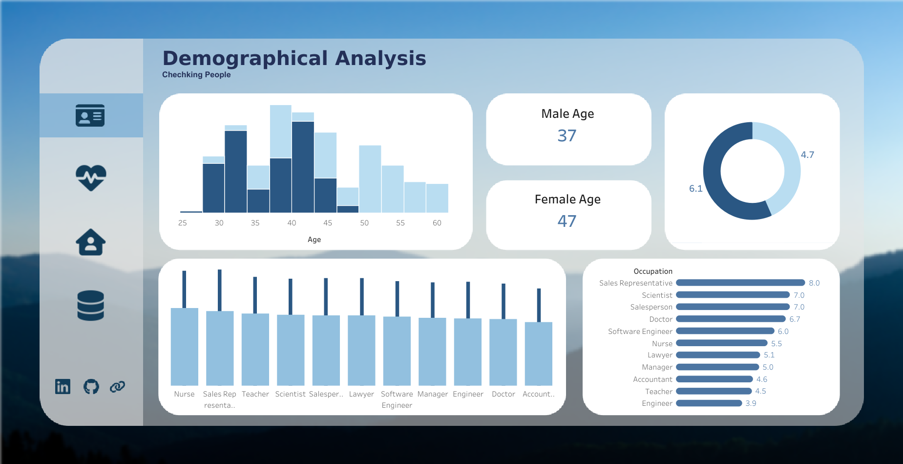
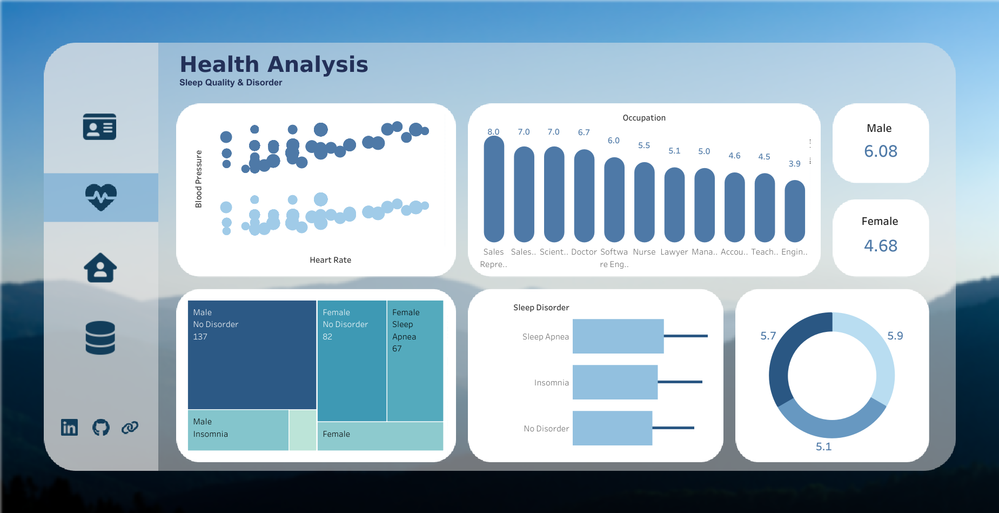
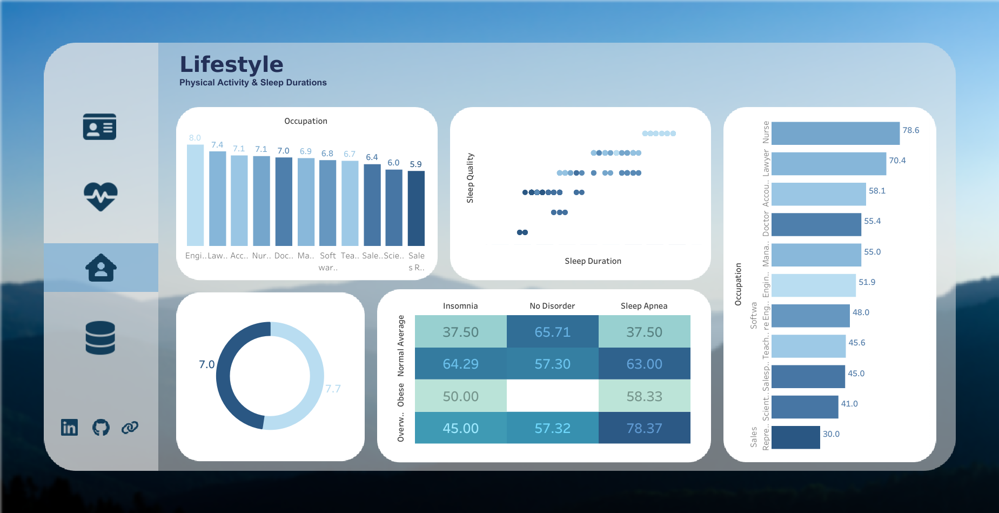
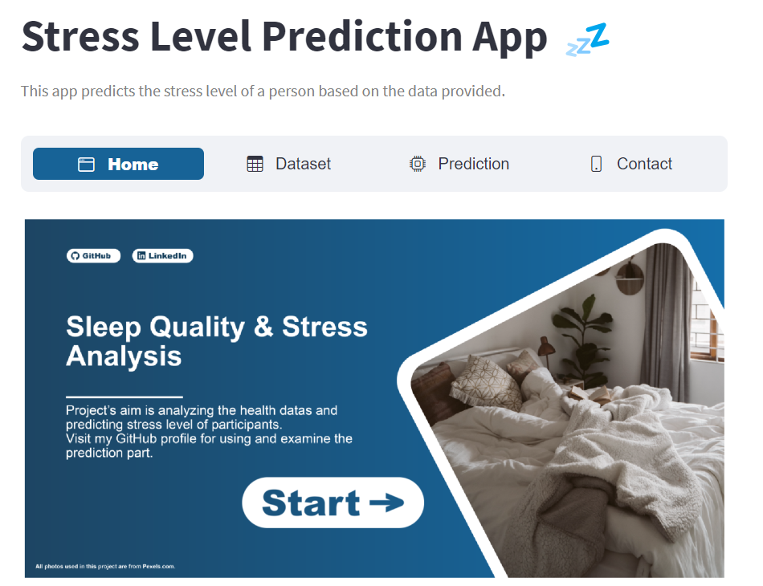
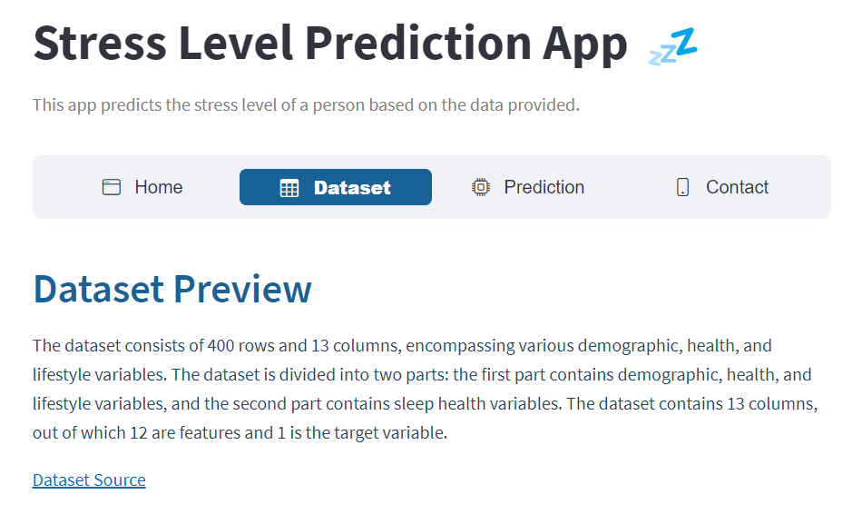
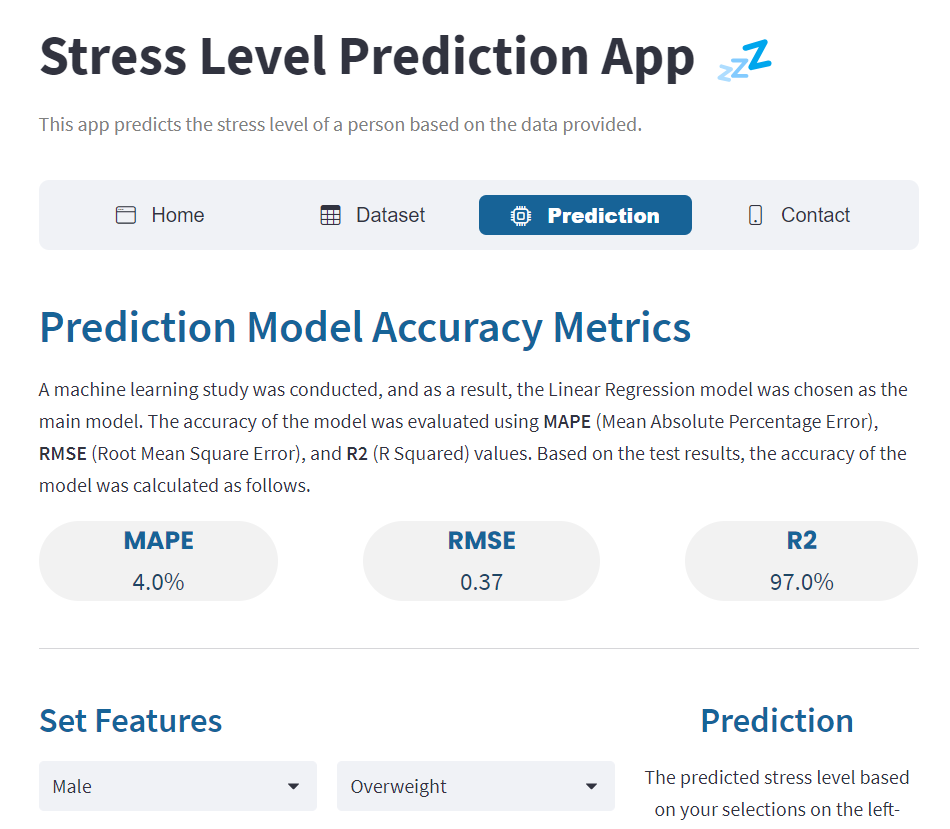
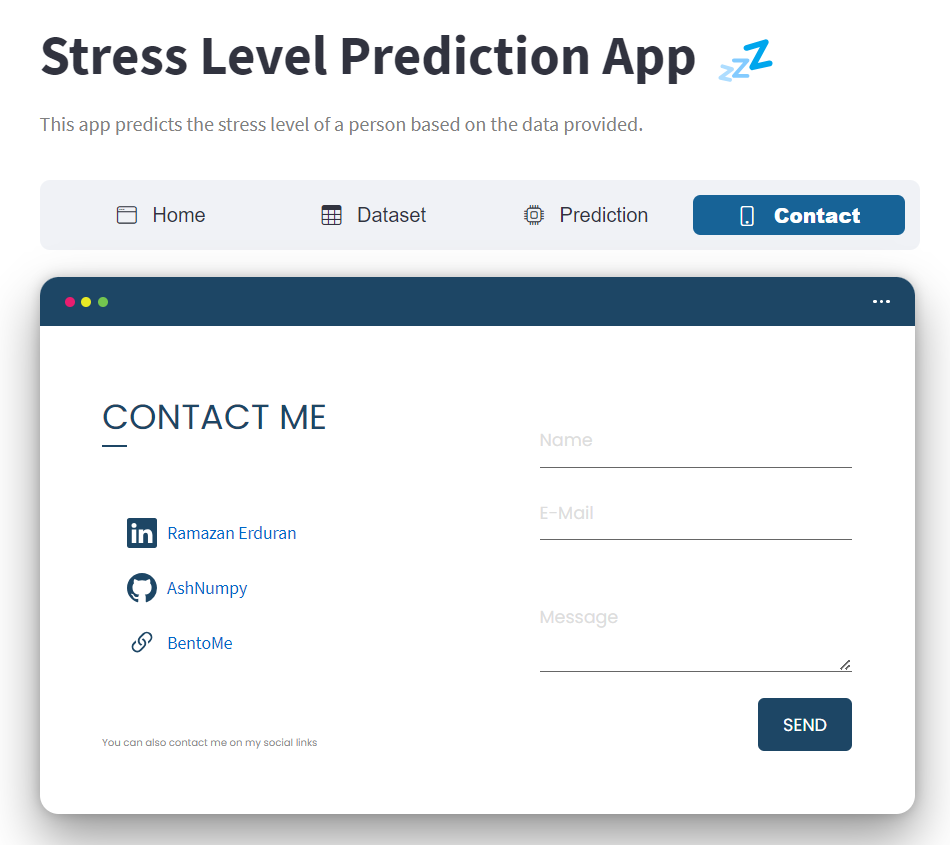

<h2 align="center"> Sleep and Health Quality Analysis</h2>
<h2 align="center"> Stress Level Prediction Web Application</h2>

### Project Overview
This project includes the analysis of sleep health and lifestyle dataset and an application for predicting stress levels using machine learning.

### Project Objectives
The main objectives of the project are to analyze and visualize the data related to health, lifestyle, and demographic factors, derive actionable insights from the visualizations, and predict stress levels of individuals using machine learning techniques.

### Project Features
- Sleep health metrics analysis: Explore factors related to sleep duration, quality, and regularity.
- Lifestyle factors analysis: Investigate physical activity levels, stress levels, and BMI categories.
- Cardiovascular health analysis: Examine blood pressure and resting heart rate measurements.
- Sleep disorder analysis: Determine the presence of sleep disorders such as insomnia and sleep apnea.

 

<b style="font-size: 16px;">Dashboard Screenshots</b>

<a href="https://public.tableau.com/app/profile/ramazan.erduran1816/viz/StressLevelHealth/Overview"><i>Click for interactive Tableau Dashboard</i></a>

  

    
  

  

    
  

  

    
  

  

    
  

 

 

<b style="font-size: 16px;">Web Application Screenshots</b>

<a href="https://sleep-health-ml-project.streamlit.app/"><i>Click for Web Application</i></a>

  

    
  

  

    
  

  

    
  

  

    
  

---

    

            <b>About the Dataset</b>
    

    

The dataset consists of 400 rows and 13 columns, containing various variables related to sleep health and lifestyle. The columns and their descriptions are as follows:

1. Person ID: Unique identifier for each individual.
2. Gender: Gender of the person (Male/Female).
3. Age: Age of the person in years.
4. Occupation: Person's occupation or profession.
5. Sleep Duration (hours): Number of hours slept by the person in a day.
6. Sleep Quality (scale: 1-10): Subjective evaluation of sleep quality on a scale from 1 to 10.
7. Physical Activity Level (minutes/day): Number of minutes spent on daily physical activity.
8. Stress Level (scale: 1-10): Subjective evaluation of stress level on a scale from 1 to 10.
9. BMI Category: BMI category of the person (e.g., Underweight, Normal, Overweight).
10. Blood Pressure (systolic/diastolic): Measurement of blood pressure represented through diastolic over systolic pressure.
11. Resting Heart Rate (bpm): Resting heart rate of the person in beats per minute.
12. Daily Steps: Number of steps taken by the person in a day.
13. Sleep Disorder: Presence or absence of a sleep disorder in the person (None, Insomnia, Sleep Apnea).

    

            <b>Technologies Used</b>
    

- **Data Visualization:** Tableau was used to create visualizations under the headings of demographics, health, and lifestyle.
- **Data Analysis:** Python and Jupyter Notebook were used to analyze the dataset and perform exploratory data analysis (EDA).
- **Machine Learning:** Machine learning and deep learning techniques were applied on the dataset to predict stress levels.
- **Application Development:** Streamlit was used to develop the stress level prediction application.

    

            <b>Installation and Usage</b>
    

    
Just double click on the `install.bat` file on the main directory. Then you can run all things manually. 

<b>
Also dashboards and web application can be used online
<ul>
<li> <a href="https://public.tableau.com/app/profile/ramazan.erduran1816/viz/StressLevelHealth/Overview"> Dashboard</a> 
<li> <a href="https://sleep-health-ml-project.streamlit.app/"> Web Application</a> 
</ul>
<b>

 
 

<i>Ramazan ERDURAN</i>

